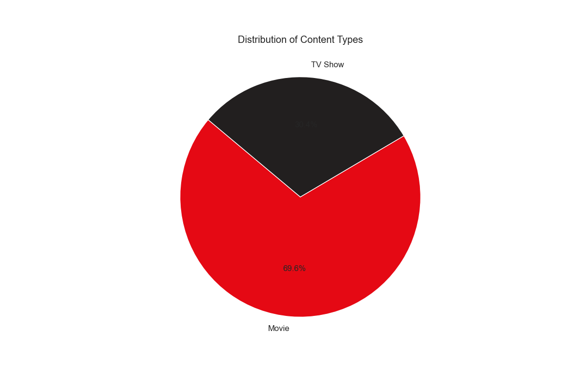
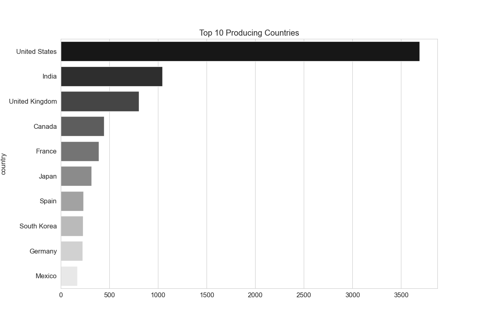
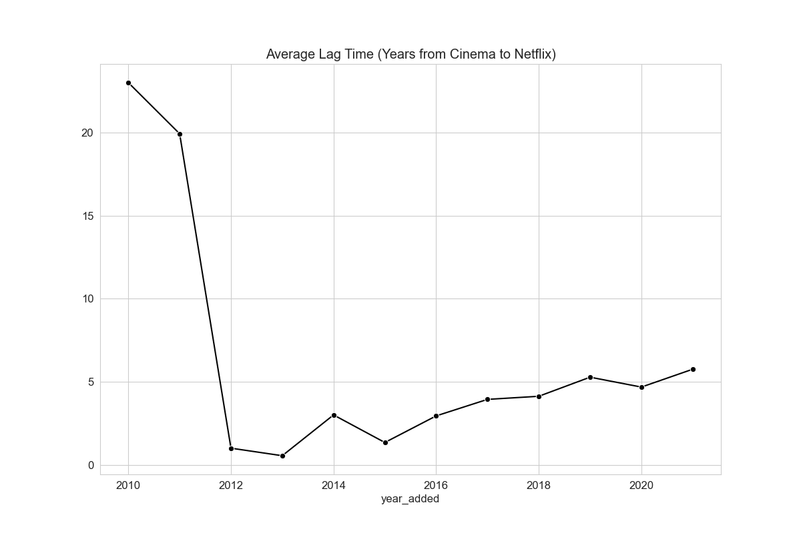
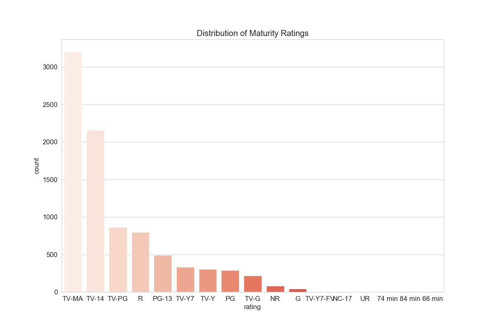
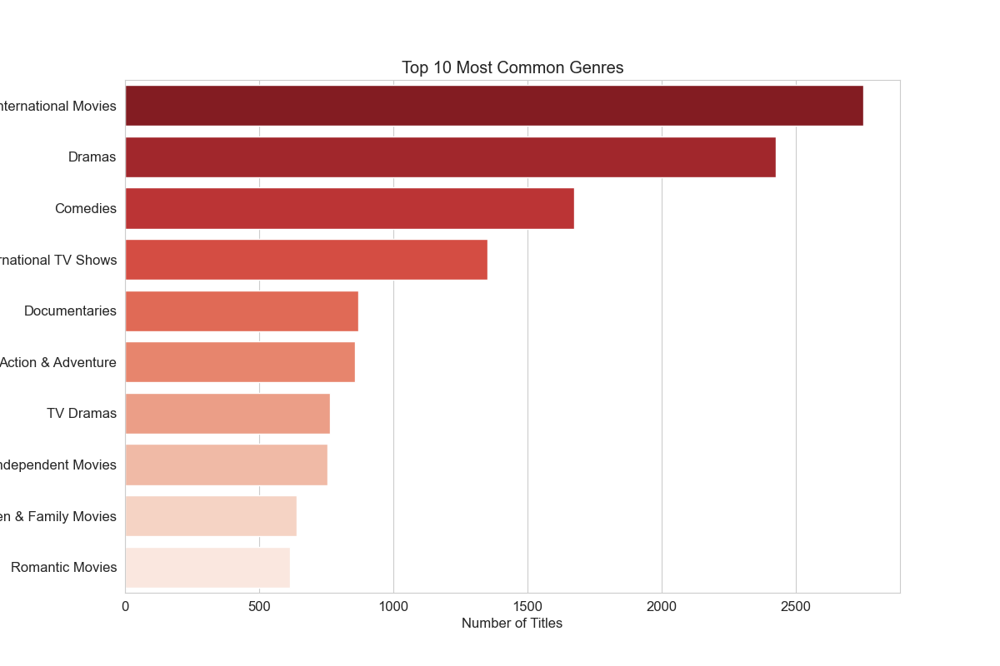
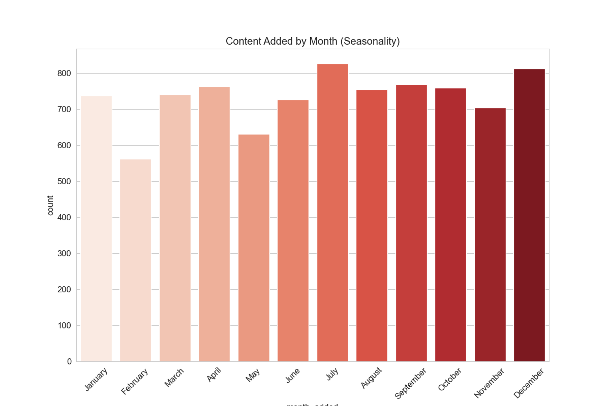
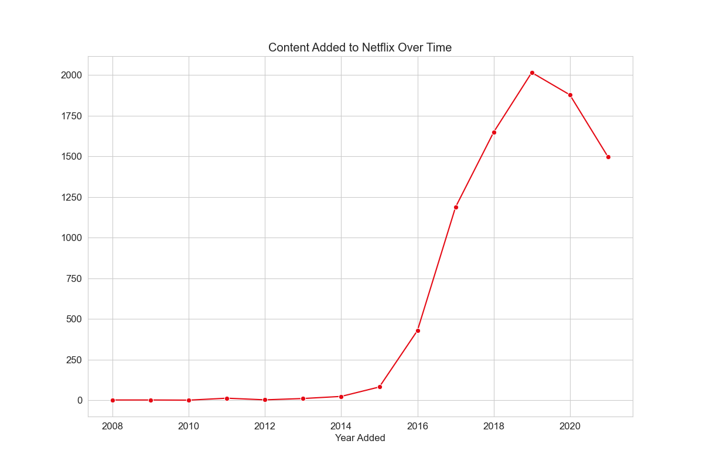
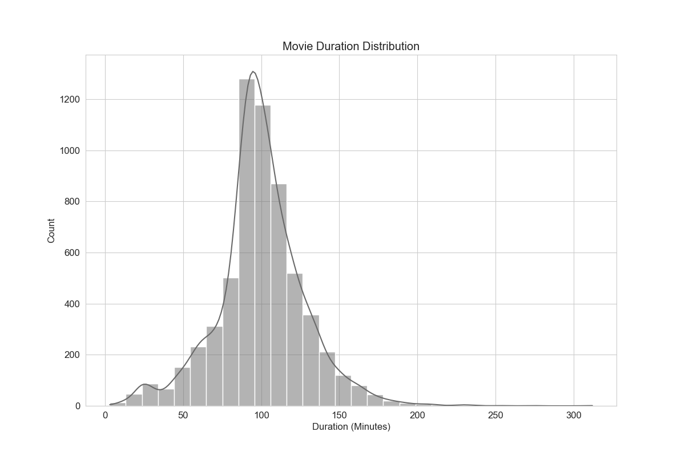
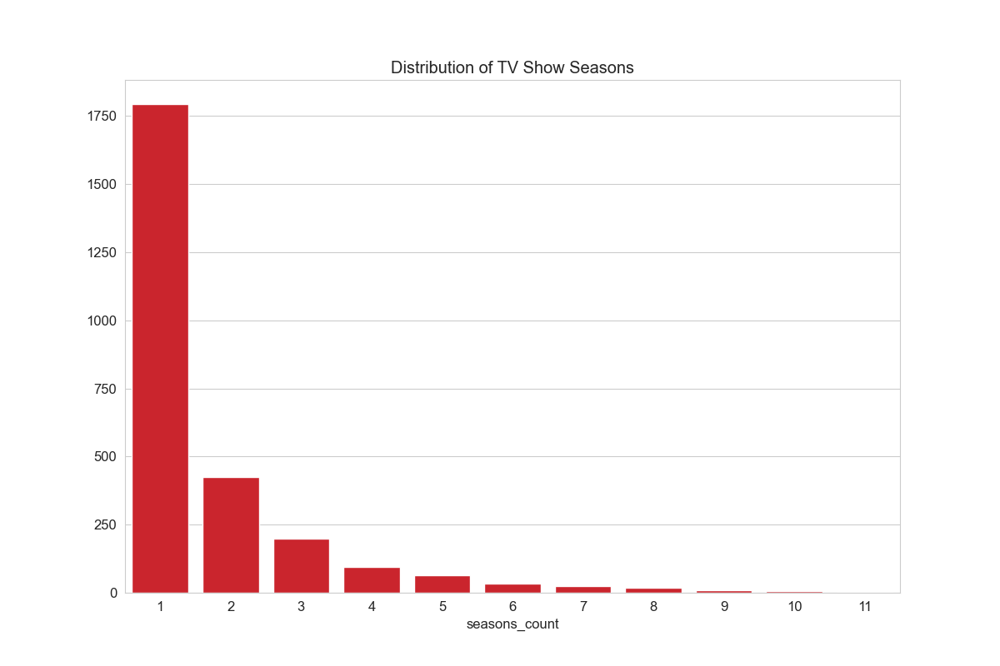
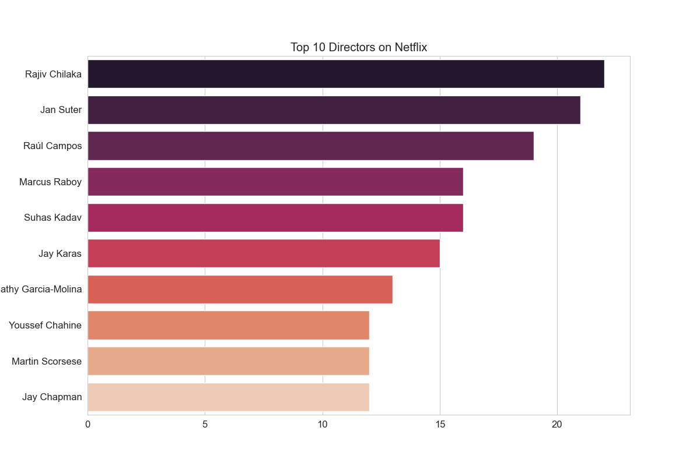

# Netflix Content Strategy & Market Analysis

## Overview
This project involves a comprehensive analysis of Netflix's content catalog, comprmising over 8,800 titles added between 2008 and 2021. Using PostgreSQL for data extraction and Pyhton for visualization, we investigate how Netflix has evolved from US centric DVD rental service into a global streaming powerhouse. The analysis uncovers trends in content production, internal expansion and genre diversification, offering data driven insights into the company's strategic pivot towards 'Originals' and international markets.

Looking for SQL queries? Look Here: [project folder](project)

## The Questions I Wanted to answer thrugh my SQL Queries Were:
1. Is Netflix focusing more on Movies or TV Shows in recent years?
2. Which countries are the biggest producers of content outside the US?
3. What are the most dominant genres in the Netflix Library?
4. How "fresh" is the content (the lag time between release and upload)?
5. Does Netflix target adults or families with it's rating strategy?
6. Is there a specific seasonal trend (like Q4) for content releases?
7. Who are the top directors driving the platform's content?
8. What is the standart duration for movies and TV Shows?
9. How has the volume of content added changed historically?
10. What is the exact distribution of content types?


# Tools I Used
- **PostgreSQL:** The core analysis engine. I chose SQL for this project to demonstrate database management skills, specifically handling array data types and complex aggregations.
- **Python (Pandas & Seaborn):** Used to visualize the SQL results, transforming numbers into 10 actionable dashboards.
- **Seaborn & Matplotlib:** Essential for version control and sharing my findings.
- **Visual Studio Code:** The IDE used for writing SQL queries and managing the Python enviroment.

# The Analysis
Each query in this project was aimed at a specific business metric. By cleaning the data and running aggregate functions, I was able to build a timeline of Netflix's strategy.

### 1. Content Type Distribution
I wanted to see if Netflix is shifting it's focus on movies or series. Despite the cultural buzz around popular series like Stranger Things, Netflix is primarly a film archive. However, this split serves two purposes: Movies attract new users , while TV Shows retain them. The strategy is a balanced ecosystem of acquisition (Movies) vs retention(TV).

```sql
SELECT 
    type, 
    COUNT(*) as total_count,
    ROUND((COUNT(*) * 100.0 / (SELECT COUNT(*) FROM netflix_titles)), 2) as percentage
FROM netflix_titles
GROUP BY type
ORDER BY total_count DESC;
```


*For this analysis i used a pie chart. Since I was comparing two distinct categories, a pie chart was the most effective way to instantly visualize the dominance without a need for reading the exact numbers.*

### 2. Global Expansion
To understand Netflix's globalization strategy, I analyzed the primary country of production. India is the second largest content producer after the US, significantly outpacing the UK. This highlights Netflix's "Next Billions Users" strategy, heavily investing in the Asian market where mobile streaming is dominant

```sql
SELECT 
    TRIM(UNNEST(STRING_TO_ARRAY(country, ','))) as country_name, 
    COUNT(*) as content_count
FROM netflix_titles
WHERE country IS NOT NULL
GROUP BY country_name
ORDER BY content_count DESC
LIMIT 10;
```


*I used a bar chart to rank the countries. This allows for an easy comparison between the dominant producer (USA) and emerging markets like India, highlighting the scale of difference.*

### 3. Content Freshness
I calculated the "The Lag Time"(Years between Release and Netflix Add) to see if the library is getting newer. The Lag Time has dropped from ~4 years in 2010 to near zero today. This confirms Netflix's pivot from a renting old movies to a releasing Originals day and date.

```sql
SELECT 
    EXTRACT(YEAR FROM TO_DATE(date_added, 'Month DD, YYYY')) as year_added,
    ROUND(AVG(EXTRACT(YEAR FROM TO_DATE(date_added, 'Month DD, YYYY')) - release_year), 1) as avg_delay_years
FROM netflix_titles
WHERE date_added IS NOT NULL
GROUP BY year_added
HAVING EXTRACT(YEAR FROM TO_DATE(date_added, 'Month DD, YYYY')) >= 2010
ORDER BY year_added DESC;
```



*I used a line chart to visualize the trend over time. This effectively demonstrates the downward slope, proving the strategic shift toward newer content.*

### 4. Maturity Ratings
I analyzed the ratings to determine if Netflix is positioning itself for producing contents for kids or adults. TV-MA is the dominant rating. Despite having a Kids profile, Netflix's core brand identity is built on edgy, adult oriented dramas distinguishing it from other streaming platforms.

```sql
SELECT 
    rating, 
    COUNT(*) as count
FROM netflix_titles
WHERE rating IS NOT NULL
GROUP BY rating
ORDER BY count DESC;
```


*I used a bar chart sorted by volume. This makes it instantly clear which demographic is the primary target for the platform*

### 5. Top Genres
I unnested the genre arrays to find the most common categories. I find out that "International Movies" as the top genre, which validates the theory that Netflix is focusing on importing global content to diversify it's library beyond Hollywood standarts.

```sql
SELECT 
    TRIM(UNNEST(STRING_TO_ARRAY(listed_in, ','))) as genre, 
    COUNT(*) as title_count
FROM netflix_titles
GROUP BY genre
ORDER BY title_count DESC
LIMIT 10;
```


*I used a horizantal bar chart to handle the long text labels of genre names, ensuring readibility.*

### 6. Seasonality
I extracted the month from the upload dates to tests for seasonality. I detected consistent spikes in December and July, suggesting that Netflix deliberately times it's biggest content dumps to align with major holiday breaks and summer vacations to maximize engagement.

```sql
SELECT 
    TO_CHAR(TO_DATE(date_added, 'Month DD, YYYY'), 'Month') as month_name,
    COUNT(*) as total_added
FROM netflix_titles
WHERE date_added IS NOT NULL
GROUP BY month_name
ORDER BY total_added DESC;
```


*I used a bar chart ordered it chronologically to reveal cylical patterns in the release schedule.*

### 7. Content Growth
I analyzed the history of content additions and observed a massive spike between 2015 and 2019 followed by a slowdown. This indicates a shift from a adding everythin to the library phase to a quality over quantity phase, where Netflix is more selective with it's investments.

```sql
SELECT 
    EXTRACT(YEAR FROM TO_DATE(date_added, 'Month DD, YYYY')) as year_added,
    COUNT(*) as total_added
FROM netflix_titles
WHERE date_added IS NOT NULL
GROUP BY year_added
ORDER BY year_added DESC;
```


*I used a line chart to visualize the volume of content added over the years.This clearly illustrates the exponential growth phase and the subsequent plateu, helping identify key strategic periods.*

### 8. Movie Duration
I extracted the minute count from a movie titles and found a normal distribution peaking strictly between 90 and 100 minutes. This proves that despite the freedom of streaming, the fundamental 1.5 hour movie format remains the unshakable industry standart.

```sql
SELECT 
    CAST(REPLACE(duration, ' min', '') AS INTEGER) as duration_minutes,
    COUNT(*) as count
FROM netflix_titles
WHERE type = 'Movie' 
  AND duration LIKE '% min'
GROUP BY duration_minutes
ORDER BY count DESC
LIMIT 10;
```


*I used a histogram to see where the most common runtimes fall. This shape reveals the industry standart for feature films.*

### 9. TV Show Longetivity
By analyzing the lifespan of TV shows I discovered that ~66% of shows only have 1 Season. This highlights the high risk of TV production. Finding a multi season hit like Stranger Things is a rare anomaly.

```sql
SELECT 
    SPLIT_PART(duration, ' ', 1) as seasons,
    COUNT(*) as title_count
FROM netflix_titles
WHERE type = 'TV Show'
GROUP BY seasons
ORDER BY title_count DESC;
```


*I used a bar chart to show the frequency of season counts. The drastic drop off after season 1 is best represented this way.*

### 10. Top Directors
I unnested the director column and found that the top names are often from international markets rather than Holloywood. This reinforces the finding that high volume content engines are regional, feeding the global library with cost effective, diverse stories.

```sql
SELECT 
    TRIM(UNNEST(STRING_TO_ARRAY(director, ','))) as director_name, 
    COUNT(*) as title_count
FROM netflix_titles
WHERE director IS NOT NULL
GROUP BY director_name
ORDER BY title_count DESC
LIMIT 10;
```



# Conclusions
This analysis provides a data backed narrative of Netflix's strategy. The data confirms they have succesfully executed a pivot from US based DVD rental to a global streaming giant.
    - The steady investment in TV shows shows a clear focus on reducing churn.
    - The massive output from India and the International Movies genre proves their future growth lies outside of the US.
    - By reducing the Lag Time to zero, Netflix has insulated itself from competitors pulling their content. They now own the supply chain.

# Closing Thoughts
This project was a fantastic way to sharpen my SQL and Python skills. Dealing with messy real world data taught me data cleaning is just as important as the analysis itself. It also showed me how powerful a simple visualization can be in telling a complex business story.